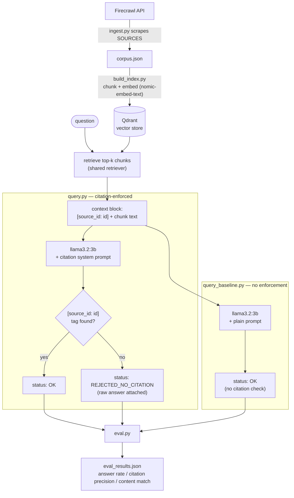

# Private Research Assistant

A local, citation-enforced RAG assistant over a BABOK + Postman API testing + Scrum
+ RAG/LLM corpus. Everything runs on-device (Ollama for embeddings/generation,
Qdrant for vector storage) except the one-time Firecrawl scrape used to build the
corpus.

## Architecture



Every corpus document is scraped from one fixed source URL and assigned a
`source_id` (e.g. `scrum_guide`, `postman_test_scripts`). Citations are tracked at
the document level, not the chunk level: a chunk carries its parent document's
`source_id` as metadata, and the model is required to tag every factual claim
with `[source_id: <id>]`.

## Prerequisites

- macOS on Apple Silicon
- Python 3.11
- [Ollama](https://ollama.com) installed
- Docker (for Qdrant)
- A [Firecrawl](https://firecrawl.dev) API key (free tier is enough for 5-8 pages)

## Setup

### 1. Install and start Ollama, pull the two models

```bash
brew install ollama
ollama serve   # leave running in its own terminal, or run as a background service
```

In another terminal:

```bash
ollama pull llama3.2:3b
ollama pull nomic-embed-text
```

Verify both are available:

```bash
ollama list
```

### 2. Start Qdrant locally via Docker

```bash
docker run -p 6333:6333 -p 6334:6334 -v "$(pwd)/qdrant_storage:/qdrant/storage" qdrant/qdrant
```

Leave this running. Verify it's up:

```bash
curl http://localhost:6333/collections
```

You should get back `{"result":{"collections":[]},...}` before you've indexed
anything.

### 3. Python environment

```bash
python3.11 -m venv venv
source venv/bin/activate
pip install -r requirements.txt
```

### 4. Configure Firecrawl

```bash
cp .env.example .env
# edit .env and set FIRECRAWL_API_KEY=<your real key>
```

## Running the pipeline

Run these in order, from the project root, with `venv` activated:

```bash
python ingest.py        # scrapes SOURCES -> corpus.json
python build_index.py   # embeds corpus.json into Qdrant
python query.py "What is a Sprint in Scrum?"    # sanity-check a single query
python eval.py           # runs eval_set.json -> eval_results.json
```

`eval_set.json` currently ships with 2 placeholder questions — replace the
`PLACEHOLDER` question text and `REPLACE_WITH_KEYWORD_*` entries with real
hand-labeled questions (aim for ~10) before treating `eval.py`'s output as
meaningful.

### Editing the source list

`ingest.py`'s `SOURCES` list is a fixed list of `(source_id, url)` pairs. Edit it
directly to point at the specific BABOK, Postman, Scrum, or RAG/LLM pages you want
in your corpus — there's no config file for this by design, since the source list
is small and changes rarely.

## What this demonstrates

**Requirements traceability as AI governance.** IIBA has publicly said the quiet
part out loud: most AI governance frameworks today are written by lawyers and
data scientists who "rarely speak the language of user stories, acceptance
criteria, or sprint backlogs" — even though traceable requirements linking
objectives to delivered components is a BA's core skill, and one the EU AI Act's
August 2026 enforcement deadline just made urgent (it requires AI systems to
maintain traceable, explainable records of how outcomes are generated). This
project is that skill applied to a concrete system, not a slide:


*A real citation-enforced answer, then a live `REJECTED_NO_CITATION` — the model
correctly refuses to answer once the retrieved context stops supporting a claim,
instead of guessing.*

- **The citation tag is an acceptance criterion, not a prompt trick.** `query.py`
  doesn't just ask the model to cite sources — it parses every answer for a
  `[source_id: <id>]` tag and returns `REJECTED_NO_CITATION`, failing closed
  rather than silently forwarding an unverifiable claim, exactly the "traceable
  record of how the outcome was generated" AI governance frameworks now require.
- **`eval.py` is Solution Evaluation, not a demo script.** It runs the same
  question set through the citation-enforced pipeline and an uninstructed
  baseline side by side and scores both on answer rate, citation precision, and
  content-match rate — turning "does this AI system meet its stated requirement"
  into a number instead of a vibe. On the real 10-question BABOK/Scrum/Postman/RAG
  eval set: the enforced pipeline answered 80% of questions with 100% citation
  precision, while the baseline answered 100% of questions with 0% citation
  precision — only one of them produces an audit trail. Full numbers in
  `eval_results.json`. (These exact percentages move somewhat from run to run —
  a 10-question sample plus a small local model's sampling variance means a
  single flipped answer swings a rate by ~10 points. The pattern that *doesn't*
  move: citation precision is dramatically higher enforced than baseline, every
  time this has been run.)
- **One of the enforced-pipeline rejections is the whole argument in
  miniature**: asked for the BABOK Guide's six knowledge areas, the model
  produced a fluent, confident answer — and three of the six names were
  fabricated (no "Data Management" or "Solution Quality Management" knowledge
  area exists in BABOK). It had no citation to back any of it, so enforcement
  caught it before you'd ever see it. That's the whole pitch in one example:
  fluent and wrong is indistinguishable from fluent and right unless something
  forces the system to show its work.
- **The eval set itself contains a question about Requirements Traceability
  Matrices**, answered through a requirements-traceability-enforcing pipeline —
  not staged, just a nice reminder that the mechanism and the study material are
  the same discipline.
- **A fully local inference stack** (Ollama + Qdrant, no cloud LLM calls), which
  matters for any BA/compliance context where source documents can't leave the
  building — governance that depends on sending your data to a third-party API
  is a harder sell than governance that runs entirely on your own machine.

### Fair caveats for a portfolio write-up

- This is a scoped MVP: single-machine, single-collection, no UI, no
  authentication, and citation enforcement is whole-answer (does the response
  contain *a* citation tag) rather than verifying every individual clause is
  correctly attributed.
- `llama3.2:3b` is a small local model; expect it to fail the citation
  requirement more often than a larger model would. That gap — and how often it
  shows up in `eval_results.json` — is itself part of the finding worth writing
  up.
